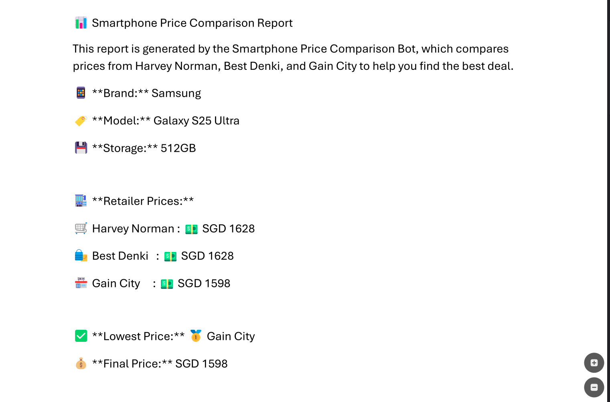
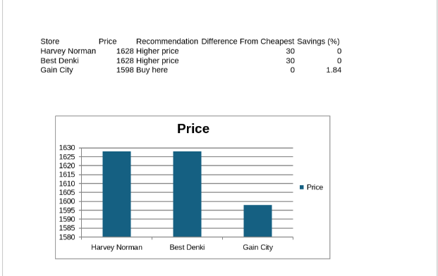

# 📱 UiPath RPA Project: Multi-Retailer Smartphone Price Comparison Bot

## 🌟 Project Objective

Design and develop a standalone **Robotic Process Automation (RPA)** application using **UiPath Studio**, demonstrating automation best practices while solving the real-world challenge of manually comparing smartphone prices across multiple retailers.

---

## 💡 Project Overview

This RPA solution eliminates the tedious process of checking Apple and Samsung smartphone prices across major Singapore retailers.  
The bot gathers price data, analyses it, and provides the **cheapest available price** alongside comprehensive summary reports.

Users provide:
- Brand (Apple / Samsung)
- Model
- Storage size (128GB / 256GB / 512GB)

The bot then:
1. Navigates to the retailer websites  
2. Extracts relevant product and pricing information  
3. Compares results  
4. Generates Excel, PDF, charts, and QR code  
5. (Optional) Sends outputs via Telegram, Email, SMS, or Voice Call  

---

## ✨ Key Features

### 🔹 User Interaction
- Guided prompts for brand, model, and storage capacity  
- Input validation for smooth workflow  

### 🔹 Automated Web Data Scraping
Retailers:
- **Gain City**
- **Harvey Norman**
- **Best Denki**

Extracts:
- Product Name  
- Product Price  
- Product URL  

### 🔹 Data Analysis
- Identifies the **cheapest available retailer**
- Computes savings percentage  
- Prepares full comparison dataset  

### 🔹 Output Generation
- Excel sheet with prices and column chart  
- PDF summary report  
- QR code linking to the lowest-priced product  
- Message box summary  

### 🔹 Optional Multi-Channel Delivery
- **Telegram** message + PDF  
- **Email** with PDF attachment  
- **SMS** with cheapest price + URL  
- **Voice Call** speaking out the lowest price  

---

## 🛠️ Technologies & Components

- **UiPath Studio**
- **Web Scraping:** Retailer websites
- **Excel:** Chart generation & data compilation
- **Word → PDF:** Report generation
- **APIs:** Telegram Bot API, SMTP Email, SMS Gateway, Voice Call API

---

## 🚧 Technical Highlights & Challenges

### 🟦 Handling Dynamic Price Locations
- Used Dynamic Selectors and Anchor Base for stable extraction.

### 🟦 Missing URL Extraction (Best Denki)
- Implemented right-click → copy-link workflow for accurate URL retrieval.

### 🟦 API Integration Failures
- Resolved by validating API tokens, endpoint correctness, and formatting phone numbers.

### 🟦 PDF Formatting Issues
- Standardized Word layout and used UiPath’s Export to PDF for consistent output.

---

## 🚀 Benefits

- Saves significant time vs manual browsing  
- Ensures accurate and consistent comparisons  
- Improves purchasing decision-making  
- Offers multiple convenient output formats  
- Generates visually rich comparison reports  

---

## 📸 Example Outputs

Below are example output formats generated by the automation (add your actual files into `/example_outputs` in your repo):

### **📊 1. Price Comparison Chart (Excel)**

  

---

### **📄 2. PhoneReport (PDF Summary Report)**

  

[View and Download the Full PDF Report directly](example_outputs/PhoneReport.pdf)
---

### **📘 3. PriceData Excel File**

  

[Download the Raw Price Comparison Data directly](example_outputs/PriceData.xlsx)
---

### **🔳 4. QR Code to Cheapest Product**

  

---

### **💬 5. Message Box Output**

  

---

### **📨 6. Telegram Output**

  

---

### **📧 7. Email Output**

  

---

### **📱 8. SMS Output**

  

### 📞 9. Automated Voice Call (Video Output)

This project also includes a video demonstration of the automated **Voice Call** feature, which uses an external service (like Twilio) to read out the cheapest price and retailer.

  <a href="https://drive.google.com/file/d/1v53xQThBfPAHZ_Nov4U-ic17RkS9925y/view?usp=sharing">Click to View Video Demonstration (Online Playback)</a>

